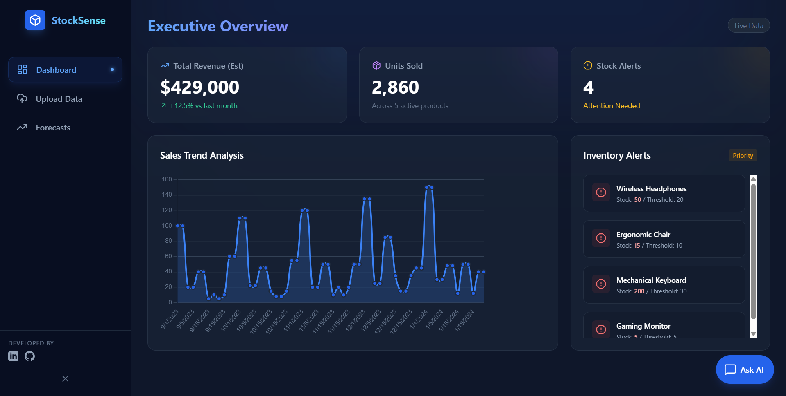
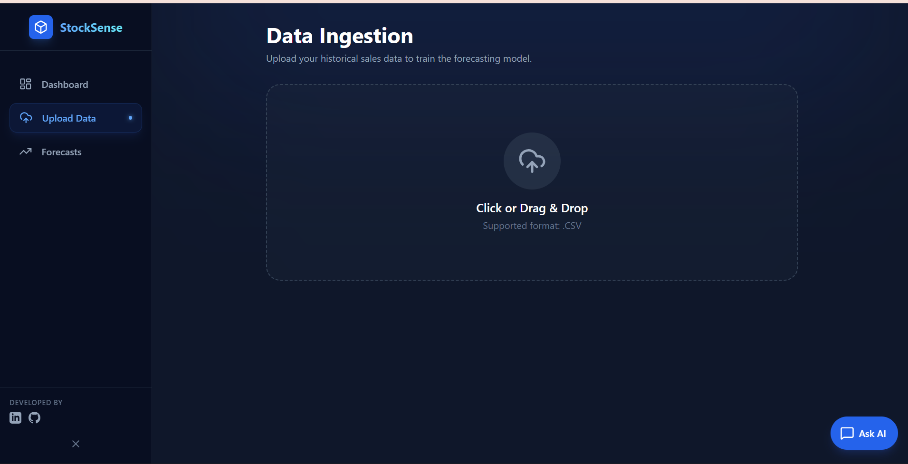
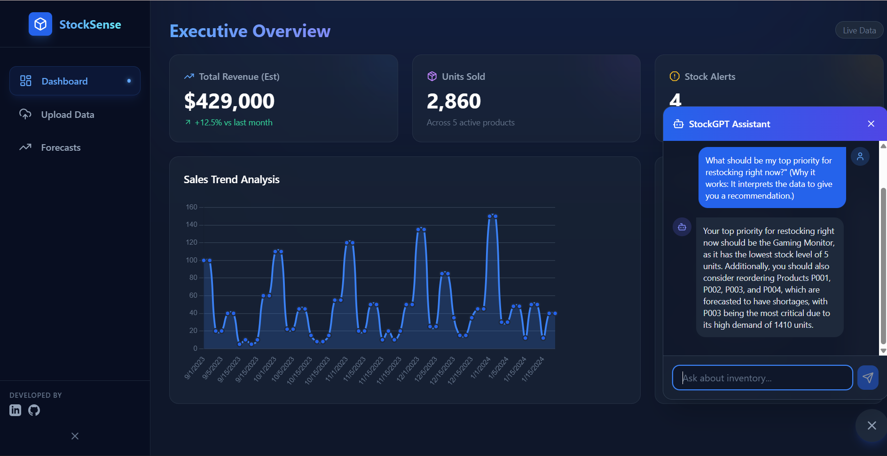

# AI-Driven Inventory Forecasting System 🚀

An intelligent full-stack dashboard that forecasts inventory needs using AI trend analysis. Built for managers to visualize sales history, predict future demand, and receive proactive reorder alerts.


## 🌟 Key Features

*   **📊 Interactive Dashboard**: Visualizes real-time sales trends using `Chart.js`.
*   **🤖 AI Forecasting**: Uses **Groq (Llama 3)** to analyze sales history and predict demand for the next 30 days.
*   **📂 CSV Upload Engine**: Drag-and-drop interface to ingest historical sales data instantly.
*   **⚠️ Smart Alerts**: Automatically flags products with `Low Stock` or `High Predicted Demand`.
*   **📄 PDF Reports**: One-click export of forecast strategies using `jsPDF`.
*   **💬 StockGPT Assistant**: Integrated AI chatbot to answer questions like *"Which products are critical today?"*.

## 📸 Screenshots

### Executive Dashboard


### CSV Upload Interface


### AI Forecasting & PDF Report


### StockGPT Assistant


## 🛠️ Tech Stack

*   **Frontend**: React.js, TailwindCSS, Lucide Icons, Sonner (Toasts)
*   **Backend**: Node.js, Express.js
*   **Database**: MongoDB (Atlas)
*   **AI Engine**: Groq SDK (Llama-3.3-70b-versatile)
    *   *Note: Replaced Claude/Gemini for superior speed and rate limits.*
*   **Tools**: jsPDF (Reporting), Recharts/Chart.js (Visualization)

## 🚀 Getting Started

### Prerequisites
*   Node.js (v16+)
*   MongoDB URI
*   Groq API Key (Free at [console.groq.com](https://console.groq.com))

### Installation

1.  **Clone the Repository**
    ```bash
    git clone https://github.com/yourusername/inventory-forecasting.git
    cd inventory-forecasting
    ```

2.  **Backend Setup**
    ```bash
    cd Backend
    npm install
    ```
    *   Create a `.env` file:
        ```env
        PORT=5000
        MONGODB_URI=your_mongodb_connection_string
        GROQ_API_KEY=your_groq_api_key
        JWT_SECRET=secret
        ```
    *   Start Server: `npm run dev` (or `nodemon server.js`)

3.  **Frontend Setup**
    ```bash
    cd frontend
    npm install
    npm run dev
    ```

4.  **Access the App**
    *   Open `http://localhost:5173` (or the port shown in terminal).

## 📂 Project Structure

```
├── Backend/
│   ├── config/         # DB and AI (Groq) configuration
│   ├── controllers/    # Logic for Forecasts, Chat, Uploads
│   ├── models/         # MongoDB Schemas (Product, Sales, Forecast)
│   ├── routes/         # API Routes
│   └── utils/          # Helpers (CSV Parser, Prompt Builder)
│
└── frontend/
    ├── src/
    │   ├── components/ # Reusable UI (ChatAssistant, etc.)
    │   ├── layout/     # Main Layout with Sidebar
    │   ├── pages/      # Dashboard, Upload, Forecast
    │   └── services/   # API Integration (Axios)
```

## 🧠 AI Implementation Details

The system uses a **Retrieval Augmented Generation (RAG)-lite** approach:
1.  **Context Injection**: The backend aggregates real-time stock levels, recent sales velocity, and active alerts.
2.  **Prompt Engineering**: This context is fed into a specialized system prompt for Llama 3.
3.  **Result**: The AI acts as a sophisticated analyst, explaining *why* a product needs restocking, not just providing a number.

## 👥 Developers

Developed by **Ajay Kumar**
*   [LinkedIn](https://www.linkedin.com/in/ajaykumar-8b2ab4258/)
*   [GitHub](https://github.com/Ajaykumar0875)

---

